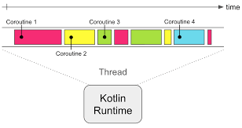
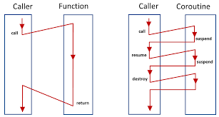

# **Kotlin Coroutines**

Coroutine is a instance of **suspendable computation**

Coroutines are used to do **async** tasks.

It is more efficient than using **threads** to do async tasks.

In a single thread you can run multiple coroutines due to support of **Suspension**

>## **Couroutine Builders**
>
>1. launch
>2. async
>3. runBlocking

## **1.launch**

1. It creates a coroutine and does not return any results, it is also called as **Fire and Forget** method.
2. It inherits the thread or coroutine from direct parent in hierarchy
3. It returns a **Job** object, which can be used to call **join() or cancel()** functions
   1. join() - It is used to wait the main thread untill the coroutine finishes the tasks.
   2. cancel() - It is used to cancel the coroutines tasks.

## **2.async**

1. In async the coroutine can return a value.
2. It returns a **Deferred** object which is child class of **Job** so the **join() or cancel()** functions can also be called.
3. To get a value from coroutine, we can use **await()** function.
   1. await() - It is a suspending funtion, like delay() 

## **3. runBlocking**

1. runBlocking builder creates a coroutine that **blocks the current executing thread** untill the coroutine finishes all the tasks, this is the only coroutine that blocks the thread and others doesn't do that.
2. Mostly runBlocking is used to **test suspending functions**

> ## **Cancelling a Coroutine**

Cancelling a coroutine is done by calling **cancel()** function, but there are some restrictions to use this function.

1. To use a cancel() function the coroutine needs to be **cooperative**
    1. To make coroutine cooperative atleast one predefined suspending function of coroutines must be used.
    2. Another way is to check CoroutineScope.isActive cancellation status.

### **Handling cancellation**

1. Cancelling a coroutine will throw a **CancellationException**
2. We can handle Timeouts (coroutines which takes more time to complete tasks can be cancelled using timeouts) by capturing **TimeoutCancellationException** 

> ## **Coroutine Execution**

1. In coroutine the code runs **sequentially in default**
2. But we can make it concurrent using **async** coroutine builder.
3. We can use **Lazy** keyword to 
    > val lazyCall = async(start = CoroutineStart.LAZY) { // code here}
4. In above code inside coroutine will not be executed untill the lazyCall val is used.

> ## **Coroutine Scopes**

1. Every coroutoine has its own coroutine scope instance attached to it
2. scope will refer to the type of coroutine they are, like **stand alone (launch), deferred (async), blocking coroutine (runBlocking)**
3. scope does not inherited from parent coroutine

> ## **Coroutine Context**

1. Every coroutoine has its own coroutine context.
2. But context can be inherited from parent coroutine.
3. There are two components in context
   1. Job
   2. Dispatcher
4. The Dispatcher is the one which decides which thread the coroutine will execute.
5. The job object will be used to call join() or cancel() functions
6. We can even assign a name to coroutine

> We can use coroutine context using **coroutineContext**

> ## **launch with parameters**
>
> 1. launch()
> 2. launch(Dispatchers.Default)
> 3. launch(Dispatchers.Unconfined)

### 1. launch() [no parameter, Dispatcher.Confined]
1. In this coroutine the thread will be inherited one from parent coroutine.
2. In this the delay() will not affect the next thread which is used
   
### 2. launch(Dispatchers.Default)
1. In this coroutine the thread will use the same thread which **GlobalScope** builder use.
2. delay() will affect next thread.

### 3. launch(Dispatcher.Unconfined)
1. It inherits the thread of parent coroutine.
2. delay() will affect next thread.

### 4. launch(coroutineContext)
1. It inherits the context of parent coroutine.

> ## **Types of Dispatchers**
> 
> 1. Default or confined
> 2. Unconfined 
> 3. Main - used UI
> 4. IO - used for IO operations

